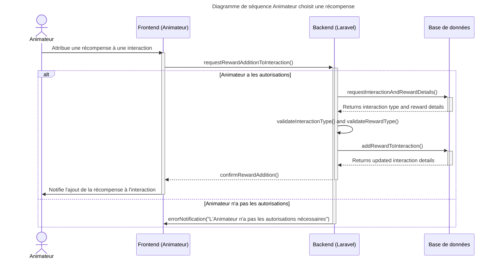

```mermaid
---
title: Diagramme de séquence Animateur choisit une récompense
---
sequenceDiagram
    Actor Animateur
    participant FrontendAnimateur as Frontend (Animateur)
    participant Backend as Backend (Laravel)
    participant DB as Base de données

    Animateur->>FrontendAnimateur: Attribue une récompense à une interaction
    activate FrontendAnimateur

    FrontendAnimateur->>+Backend: requestRewardAdditionToInteraction()
    activate Backend

    alt Animateur a les autorisations
        Backend->>+DB: requestInteractionAndRewardDetails()
        activate DB

        DB-->>-Backend: Returns interaction type and reward details
        deactivate DB

        Backend->>Backend: validateInteractionType() and validateRewardType()

        Backend->>+DB: addRewardToInteraction()
        activate DB

        DB-->>-Backend: Returns updated interaction details
        deactivate DB

        Backend-->>FrontendAnimateur: confirmRewardAddition()
        deactivate Backend

        FrontendAnimateur->>Animateur: Notifie l'ajout de la récompense à l'interaction
        deactivate FrontendAnimateur
    else Animateur n'a pas les autorisations
        Backend->>FrontendAnimateur: errorNotification("L'Animateur n'a pas les autorisations nécessaires")
        deactivate Backend
    end
```

