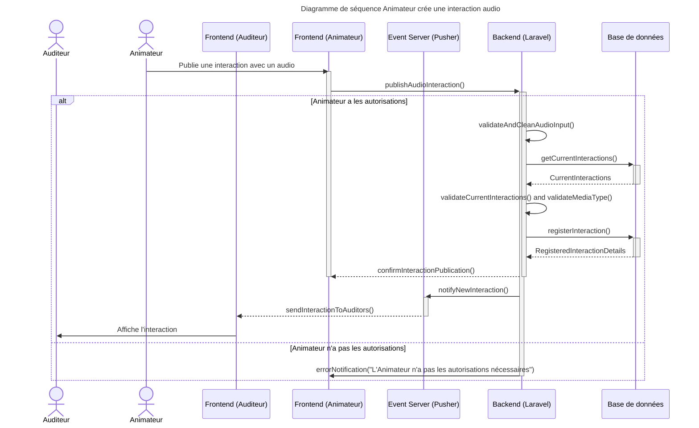

```mermaid
---
title: Diagramme de séquence Animateur crée une interaction audio
---
sequenceDiagram
    Actor Auditeur
    Actor Animateur
    participant FrontendAuditeur as Frontend (Auditeur)
    participant FrontendAnimateur as Frontend (Animateur)
    participant Event as Event Server (Pusher)
    participant Backend as Backend (Laravel)
    participant DB as Base de données

    Animateur->>FrontendAnimateur: Publie une interaction avec un audio
    activate FrontendAnimateur

    FrontendAnimateur->>+Backend: publishAudioInteraction()
    activate Backend

    alt Animateur a les autorisations
        Backend->>Backend: validateAndCleanAudioInput()

        Backend->>+DB: getCurrentInteractions()
        activate DB

        DB-->>-Backend: CurrentInteractions
        deactivate DB

        Backend->>Backend: validateCurrentInteractions() and validateMediaType()

        Backend->>+DB: registerInteraction()
        activate DB

        DB-->>-Backend: RegisteredInteractionDetails
        deactivate DB

        Backend-->>FrontendAnimateur: confirmInteractionPublication()
        deactivate Backend
        deactivate FrontendAnimateur

        Backend->>+Event: notifyNewInteraction()
        activate Event

        Event-->>FrontendAuditeur: sendInteractionToAuditors()
        deactivate Event

        FrontendAuditeur->>Auditeur: Affiche l'interaction
    else Animateur n'a pas les autorisations
        Backend->>FrontendAnimateur: errorNotification("L'Animateur n'a pas les autorisations nécessaires")
        deactivate Backend
    end
```

