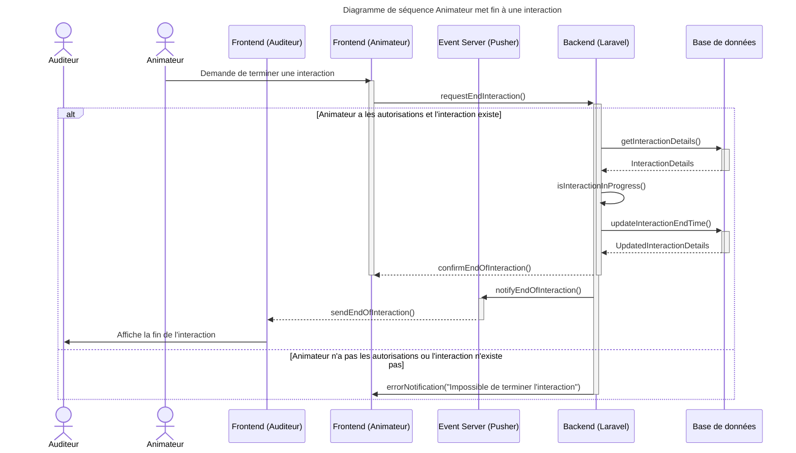

```mermaid
---
title: Diagramme de séquence Animateur met fin à une interaction
---
sequenceDiagram
    Actor Auditeur
    Actor Animateur
    participant FrontendAuditeur as Frontend (Auditeur)
    participant FrontendAnimateur as Frontend (Animateur)
    participant Event as Event Server (Pusher)
    participant Backend as Backend (Laravel)
    participant DB as Base de données

    Animateur->>FrontendAnimateur: Demande de terminer une interaction
    activate FrontendAnimateur

    FrontendAnimateur->>+Backend: requestEndInteraction()
    activate Backend

    alt Animateur a les autorisations et l'interaction existe
        Backend->>+DB: getInteractionDetails()
        activate DB

        DB-->>-Backend: InteractionDetails
        deactivate DB

        Backend->>Backend: isInteractionInProgress()

        Backend->>+DB: updateInteractionEndTime()
        activate DB

        DB-->>-Backend: UpdatedInteractionDetails
        deactivate DB

        Backend-->>FrontendAnimateur: confirmEndOfInteraction()
        deactivate Backend
        deactivate FrontendAnimateur

        Backend->>+Event: notifyEndOfInteraction()
        activate Event

        Event-->>FrontendAuditeur: sendEndOfInteraction()
        deactivate Event

        FrontendAuditeur->>Auditeur: Affiche la fin de l'interaction
    else Animateur n'a pas les autorisations ou l'interaction n'existe pas
        Backend->>FrontendAnimateur: errorNotification("Impossible de terminer l'interaction")
        deactivate Backend
    end
```

