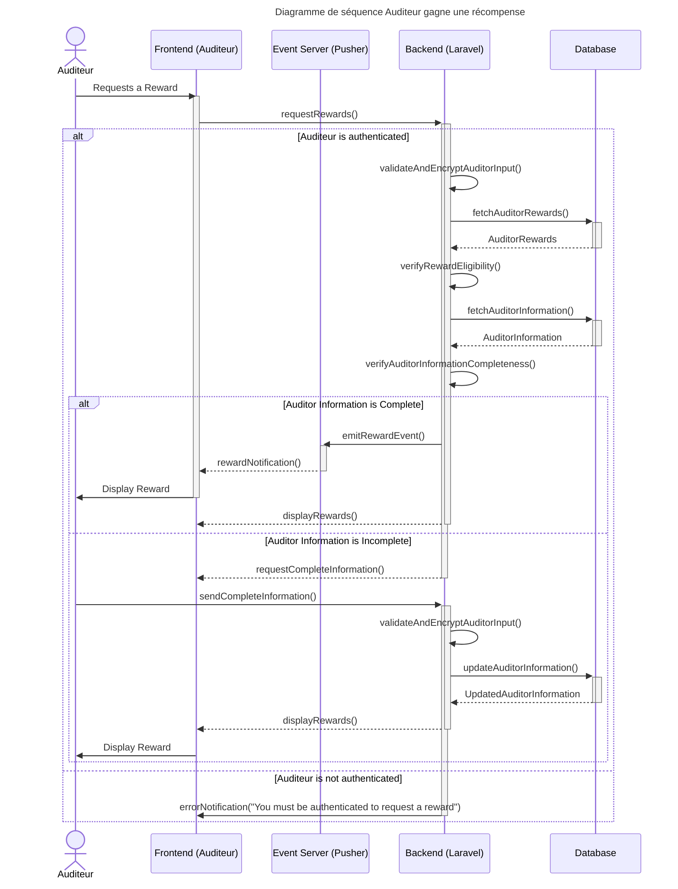

```mermaid
---
title: Diagramme de séquence Auditeur gagne une récompense
---
sequenceDiagram
    Actor Auditeur
    participant FrontendAuditeur as Frontend (Auditeur)
    participant Event as Event Server (Pusher)
    participant Backend as Backend (Laravel)
    participant DB as Database
    

    Auditeur->>FrontendAuditeur: Requests a Reward
    activate FrontendAuditeur

    FrontendAuditeur->>+Backend: requestRewards()
    activate Backend

    alt Auditeur is authenticated
        Backend->>Backend: validateAndEncryptAuditorInput()

        Backend->>+DB: fetchAuditorRewards()
        activate DB

        DB-->>-Backend: AuditorRewards
        deactivate DB

        Backend->>Backend: verifyRewardEligibility()

        Backend->>+DB: fetchAuditorInformation()
        activate DB

        DB-->>-Backend: AuditorInformation
        deactivate DB

        Backend->>Backend: verifyAuditorInformationCompleteness()

        alt Auditor Information is Complete
            Backend->>+Event: emitRewardEvent()
            activate Event

            Event-->>FrontendAuditeur: rewardNotification()
            deactivate Event

            FrontendAuditeur->>Auditeur: Display Reward
            deactivate FrontendAuditeur

            Backend-->>FrontendAuditeur: displayRewards()
            deactivate Backend
        else Auditor Information is Incomplete
            Backend-->>FrontendAuditeur: requestCompleteInformation()
            deactivate Backend

            Auditeur->>+Backend: sendCompleteInformation()
            activate Backend

            Backend->>Backend: validateAndEncryptAuditorInput()

            Backend->>+DB: updateAuditorInformation()
            activate DB

            DB-->>-Backend: UpdatedAuditorInformation
            deactivate DB

            Backend-->>FrontendAuditeur: displayRewards()
            deactivate Backend

            FrontendAuditeur->>Auditeur: Display Reward
        end
    else Auditeur is not authenticated
        Backend->>FrontendAuditeur: errorNotification("You must be authenticated to request a reward")
        deactivate Backend
    end
```

