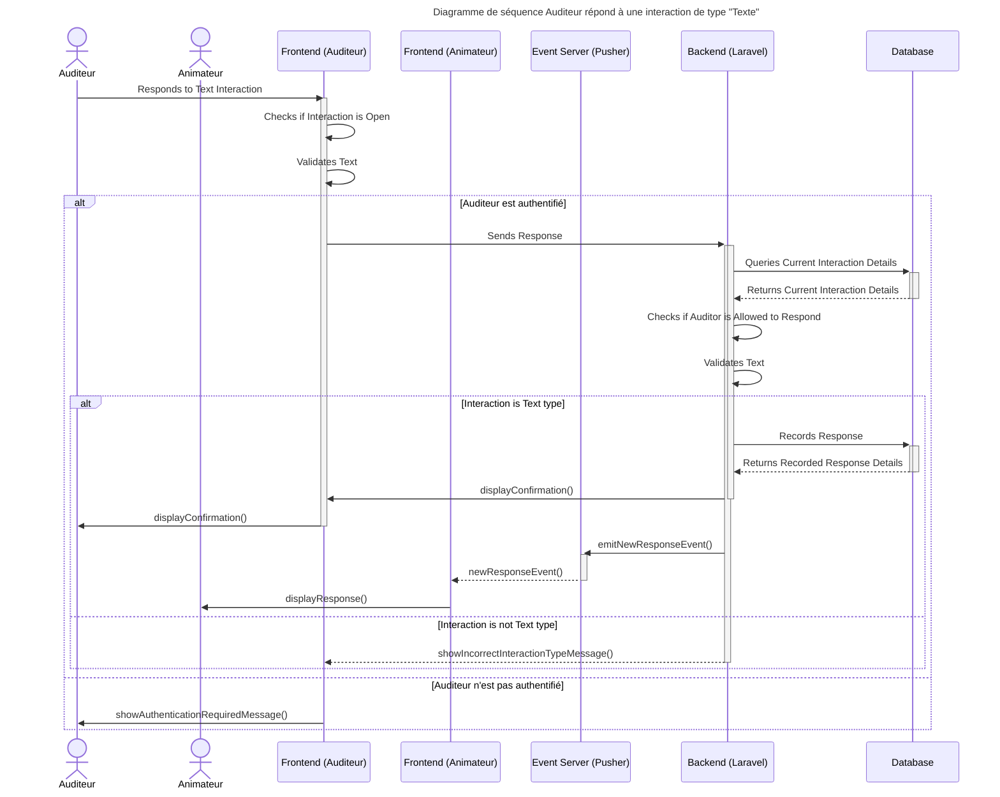

```mermaid
---
title: Diagramme de séquence Auditeur répond à une interaction de type "Texte"
---
sequenceDiagram
    Actor Auditeur
    Actor Animateur
    participant FrontendAuditeur as Frontend (Auditeur)
    participant FrontendAnimateur as Frontend (Animateur)
    participant Event as Event Server (Pusher)
    participant Backend as Backend (Laravel)
    participant DB as Database

    Auditeur->>FrontendAuditeur: Responds to Text Interaction
    activate FrontendAuditeur

    FrontendAuditeur->>FrontendAuditeur: Checks if Interaction is Open
    FrontendAuditeur->>FrontendAuditeur: Validates Text

    alt Auditeur est authentifié
        FrontendAuditeur->>+Backend: Sends Response
        activate Backend

        Backend->>+DB: Queries Current Interaction Details
        activate DB

        DB-->>-Backend: Returns Current Interaction Details
        deactivate DB

        Backend->>Backend: Checks if Auditor is Allowed to Respond
        Backend->>Backend: Validates Text

        alt Interaction is Text type
            Backend->>+DB: Records Response
            activate DB

            DB-->>-Backend: Returns Recorded Response Details
            deactivate DB

            Backend->>FrontendAuditeur: displayConfirmation()
            deactivate Backend

            FrontendAuditeur->>Auditeur: displayConfirmation()
            deactivate FrontendAuditeur

            Backend->>+Event: emitNewResponseEvent()
            activate Event

            Event-->>FrontendAnimateur: newResponseEvent()
            deactivate Event

            FrontendAnimateur->>Animateur: displayResponse()
        else Interaction is not Text type
            Backend-->>FrontendAuditeur: showIncorrectInteractionTypeMessage()
            deactivate Backend
        end
    else Auditeur n'est pas authentifié
        FrontendAuditeur->>Auditeur: showAuthenticationRequiredMessage()
    end
```

