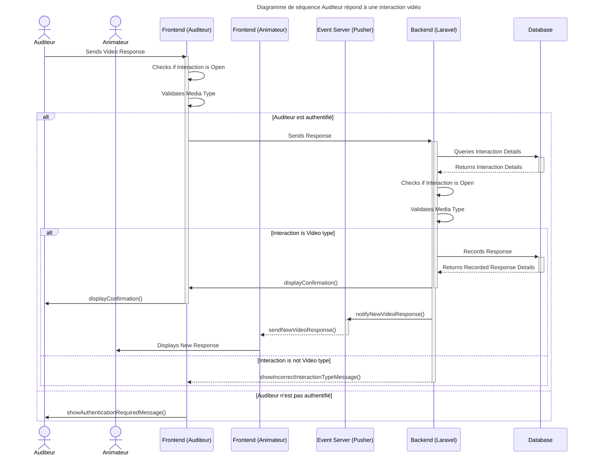

```mermaid
---
title: Diagramme de séquence Auditeur répond à une interaction vidéo
---
sequenceDiagram
    Actor Auditeur
    Actor Animateur
    participant FrontendAuditeur as Frontend (Auditeur)
    participant FrontendAnimateur as Frontend (Animateur)
    participant Event as Event Server (Pusher)
    participant Backend as Backend (Laravel)
    participant DB as Database

    Auditeur->>FrontendAuditeur: Sends Video Response
    activate FrontendAuditeur

    FrontendAuditeur->>FrontendAuditeur: Checks if Interaction is Open
    FrontendAuditeur->>FrontendAuditeur: Validates Media Type

    alt Auditeur est authentifié
        FrontendAuditeur->>+Backend: Sends Response
        activate Backend

        Backend->>+DB: Queries Interaction Details
        activate DB

        DB-->>-Backend: Returns Interaction Details
        deactivate DB

        Backend->>Backend: Checks if Interaction is Open
        Backend->>Backend: Validates Media Type

        alt Interaction is Video type
            Backend->>+DB: Records Response
            activate DB

            DB-->>-Backend: Returns Recorded Response Details
            deactivate DB

            Backend->>FrontendAuditeur: displayConfirmation()
            deactivate Backend

            FrontendAuditeur->>Auditeur: displayConfirmation()
            deactivate FrontendAuditeur

            Backend->>+Event: notifyNewVideoResponse()
            activate Event

            Event-->>FrontendAnimateur: sendNewVideoResponse()
            deactivate Event

            FrontendAnimateur->>Animateur: Displays New Response
        else Interaction is not Video type
            Backend-->>FrontendAuditeur: showIncorrectInteractionTypeMessage()
            deactivate Backend
        end
    else Auditeur n'est pas authentifié
        FrontendAuditeur->>Auditeur: showAuthenticationRequiredMessage()
    end
```

