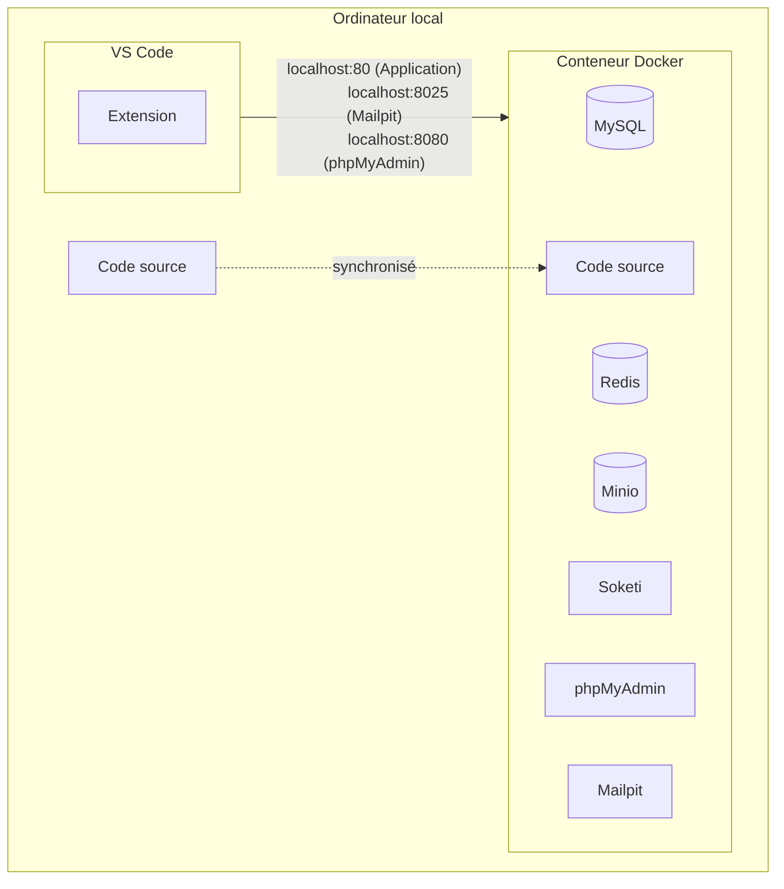

# Environnement de développement




> Nous utilisons Docker pour créer un environnement de développement isolé. Cela permet de ne pas avoir à installer les dépendances sur votre ordinateur et de pouvoir partager le même environnement de développement entre tous les développeurs. Cela permet aussi de ne pas avoir à installer PHP, MySQL, Redis, etc. sur votre ordinateur.

## Choix des technologies
- **Conteneur Docker (devContainer)** : Docker est une plateforme qui permet d'emballer, de distribuer et de gérer les applications dans des conteneurs. Les conteneurs Docker isolent le logiciel de son environnement pour s'assurer qu'il fonctionne de manière uniforme, quel que soit l'endroit où il est déployé. Le `devContainer` est un conteneur spécifiquement conçu pour le développement, contenant toutes les dépendances nécessaires à l'exécution de l'application.
    
- **MySQL** : C'est un système de gestion de bases de données relationnelles (SGBDR). MySQL est très populaire pour les applications web et fait partie de la pile technologique LAMP (Linux, Apache, MySQL, PHP).
    
- **Redis** : C'est un magasin de structure de données en mémoire, utilisé comme base de données, cache et courtier de messages. Il est connu pour sa haute performance et son utilisation flexible de structures de données.
    
- **Minio** : C'est une solution de stockage d'objets de haute performance. Minio est compatible avec Amazon S3, ce qui permet de stocker de grandes quantités de données non structurées, comme des photos, des vidéos, des fichiers journaux, des sauvegardes et des conteneurs.
    
- **Soketi** : C'est un serveur WebSocket simple, rapide et fiable compatible avec Pusher. Il est généralement utilisé pour les communications en temps réel entre le client et le serveur.
    
- **phpMyAdmin** : C'est un outil de gestion de MySQL basé sur le web. Il offre une interface utilisateur conviviale pour effectuer une grande variété de tâches telles que la création, la modification ou la suppression de bases de données, de tables, de champs ou de lignes.
    
- **Mailpit** : C'est un outil de test de courrier électronique pour les développeurs. Il intercepte les courriels envoyés par l'application et les affiche dans une interface web. Cela permet aux développeurs de tester les fonctionnalités d'envoi de courrier sans avoir à configurer un serveur de courrier électronique.

L'architecture décrite dans le graphe utilise Docker pour isoler l'environnement de développement, ce qui permet d'avoir un environnement reproductible sur n'importe quelle machine. Les divers services sont exécutés dans le conteneur Docker, ce qui simplifie la gestion des dépendances. Le code source est écrit localement dans VS Code, puis synchronisé avec le conteneur pour être exécuté et testé. Afin d'alléger les configuration local, le choix s'est porté sur GitHub Codespaces afin de ne pas à avoir à installer docker sur toutes les machines des développeurs.

## Utiliser GitHub Codespaces (recommandé)

### 1. Créer un codespace

-   Ouvrir le projet dans GitHub
-   Cliquer sur le bouton `Code` et sélectionner l'onglet `Codespaces`
-   Cliquer sur le bouton `Create codespace on main`


### 2. Ouvrir le codespace dans VS Code ou PhpStorm

-   Faire suivant suivant, ouvrir ouvrir, oui oui, installer installer, etc.

Après quelques minutes, vous devriez voir une fenêtre de sélection de l'environnement de développement s'ouvrir.

### 3. Ouvrir l'application dans le navigateur

Quand le conteneur est prêt, vous devriez voir un icône (une petite antenne) dans la barre d'outils de VS Code.

Cette vue liste tous les points d'entrée disponible.


Vous pouvez maintenant ouvrir l'application dans votre navigateur à l'adresse [http://localhost:80](http://localhost:80).


Voilàà ! Vous pouvez maintenant commencer à développer.

### 4. Informations utiles

#### Information de connexion phpMyAdmin

Serveur: mysql   
Username: root   
Password: (aucun)   

#### Information de connexion sur l'application

Email: Voir le champs `email` dans la base de donnée.   
Password: password (pour les comptes auditeurs et animateurs)

### 5. (Attention) Avant de fermer VS Code

Avant de fermer VS Code, il faut arrêter le conteneur.

-   En bas à gauche, cliquer sur l'icône `>< Codespaces` pour ouvrir le menu des codespaces
-   Cliquer sur l'option `Stop Current Codespace`, sinon le conteneur va continuer de tourner et le temps sera décompté de votre forfait (60 heures gratuit par mois).


## Configuration sur Windows

## Prérequis

-   [Docker](https://www.docker.com/)
-   [WSL2](https://learn.microsoft.com/en-us/windows/wsl/about)
-   [VS Code](https://code.visualstudio.com/)
-   [VS Code - Remote Development (Extension)](Extension))

### 1. Cloner le projet

Ouvrir l'application _Terminal_ et sélectionner le sous-système Ubuntu.


```bash
git clone https://github.com/C-Super/couleur3.git
```

### 2. Ouvrir le projet dans VS Code

Ouvrir le dossier du projet dans VS Code en utilisant le terminal Ubuntu.

```bash
cd couleur3 && code .
```

### 3. Ouvrir le projet dans un conteneur

Si ce n'est pas déjà fait, installer l'extension [Remote Development](https://marketplace.visualstudio.com/items?itemName=ms-vscode-remote.vscode-remote-extensionpack) dans VS Code.

Et n'oubliez pas de lancer l'application Docker Desktop, avant !

Vous devriez voir une fenêtre de sélection de l'environnement de développement s'ouvrir.


Si vous ne voyer pas la fenêtre de sélection de l'environnement de développement.

-   Ouvrir la palette de commande (Ctrl + Shift + P)
-   Rechercher et sélectionner `Remote-Containers: Open Folder in Container...`
-   Sélectionner le dossier du projet

Cela peut prendre quelques minutes la première fois que vous ouvrez le projet dans un conteneur.

### 4. Ouvrir l'application dans le navigateur

Quand le conteneur est prêt, vous devriez voir un icône (une petite antenne) dans la barre d'outils de VS Code.


Vous pouvez maintenant ouvrir l'application dans votre navigateur à l'adresse [http://localhost:8080](http://localhost:80).


Voilàà ! Vous pouvez maintenant commencer à développer.

### 5. Installer les extensions VS Code recommandées

### 6. Conclusion

Quand vous ouvrirez VS Code, les prochaines fois, vous pourrez ouvrir le projet dans un conteneur en cliquant sur l'icône de l'antenne dans la barre d'outils.

## Configuration sur Mac
