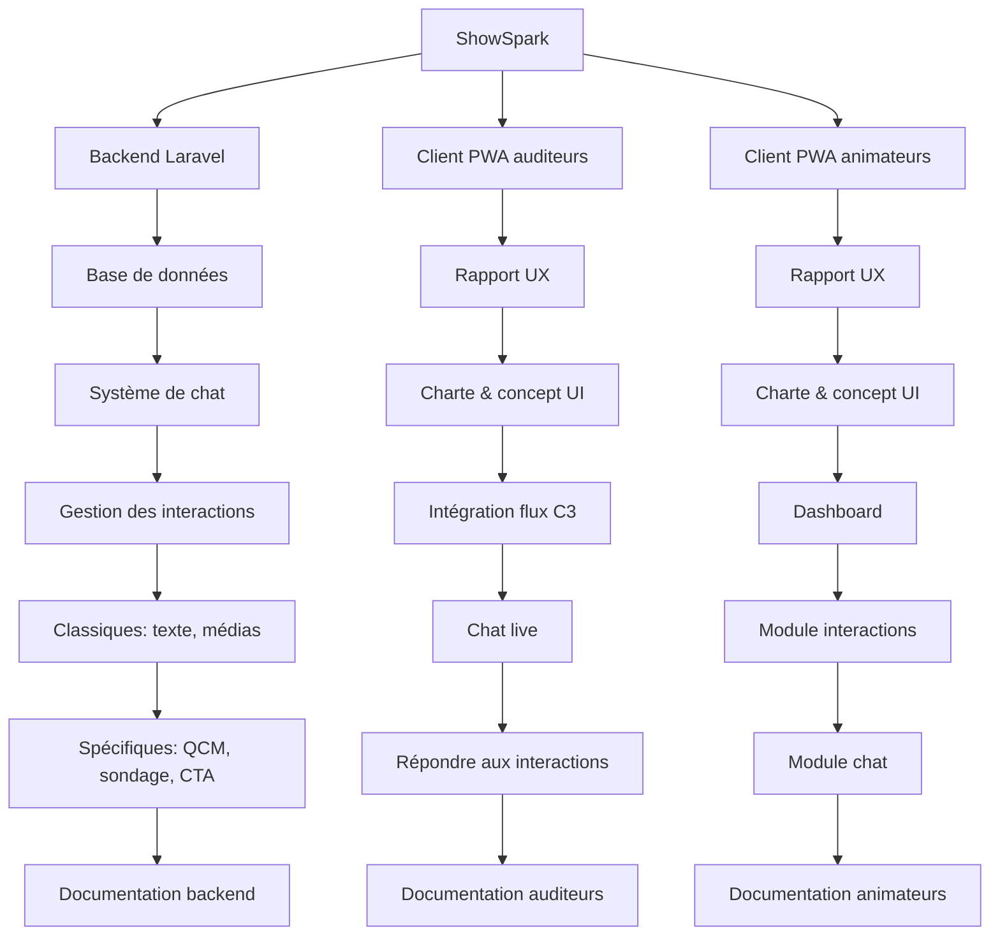
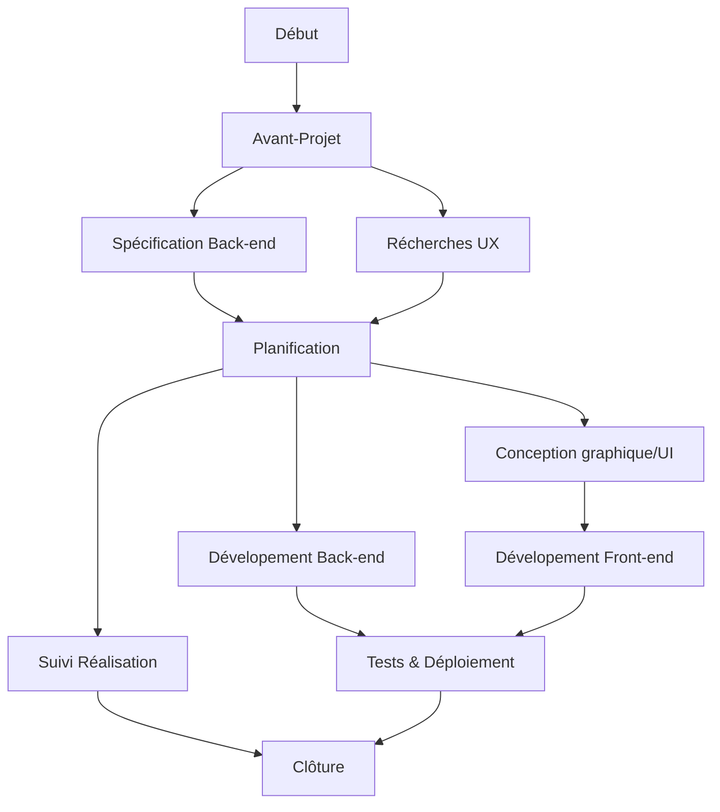

**Groupe** : super
**Membres** : BOHREN Joris, DA FONSECA Carina, DULEX Samuel, FORELICHER Cassandre, LONGO Rossiny, MENDES Daniel, REY Myriam, WUNDERLE Nicolas
**Classe** : M50-2
**Version** : 1
## Project Breakdown Structure

## Tableau des livrables
### Equipe
**DM**: Daniel Mendes, ingénieur full-stack, administrateur système
**SD**: Samuel Dulex, ingénieur back-end, scrum master 
**MR**: Myriam Rey, conceptrice UX, graphiste, gestion de projet
**CDF**: Carina Da Fonseca, conceptrice UX, graphiste
**CF**: Cassandre Froelicher, conceptrice UX, ingénieure front-end
**RL**: Rossiny Longo, conceptrice UX, ingénieure front-end
**NW**: Nicolas Wunderle, concepteur UX, ingénieur front-end
**JB**: Joris Bohren, gestion de projet, product owner

| Livrable                         | Durée |     Ressources      |
|:-------------------------------- |:----- |:-------------------:|
| Base de données                  | 60h   |       DM, SD        |
| Système de chat                  | 70h   |         DM          |
| Gestion des interactions backend | 70h   |         SD          |
| Rapports UX                      | 150h  | MR, CDF, CF, RL, NW |
| Charte & concept UI              | 48h   |       MR, CDF       |
| Intégration flux C3              | 29h   |       NW, RL        |
| Client chat                      | 45h   |         DM          |
| Interface interactions auditeurs | 85h   |       NW, RL        |
| Dashboard animateurs             | 158h  |       CF, DM        |
| Mise en production               | 108h  |        Tous         |
| Documentation                    | 102h  |       JB, MR        |
## Réseau d'activités

## [Gantt des livrables](planificationGantt.md)
(voir annexe)