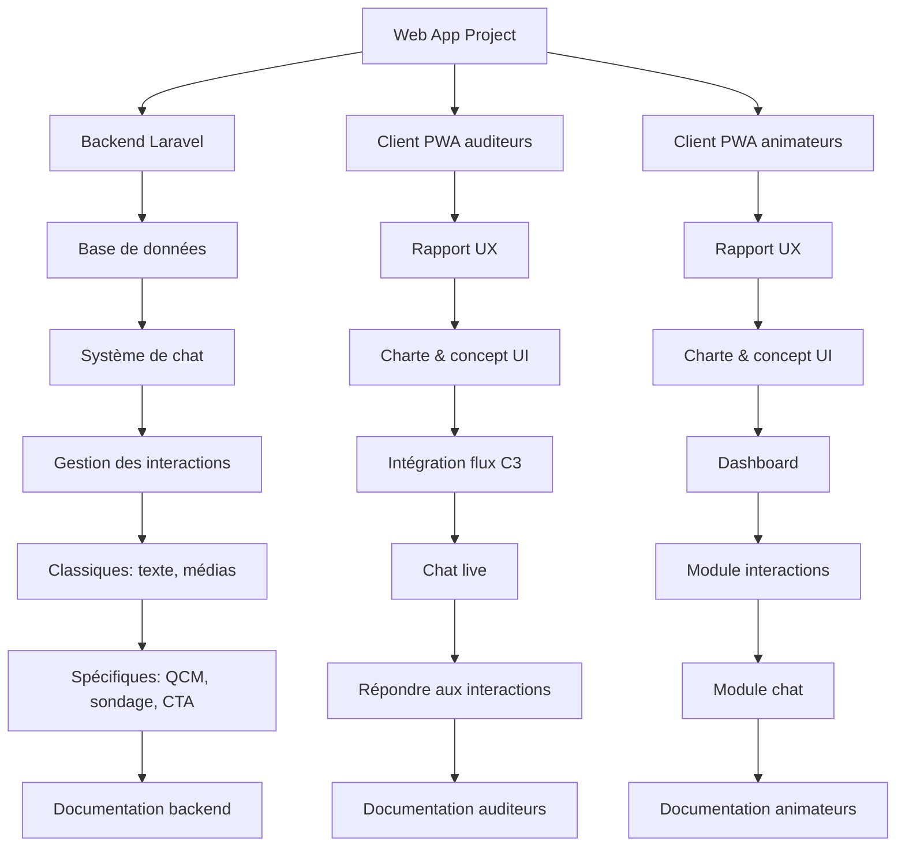

**Groupe** : super
**Membres** : BOHREN Joris, DA FONSECA Carina, DULEX Samuel, FORELICHER Cassandre, LONGO Rossiny, MENDES Daniel, REY Myriam, WUNDERLE Nicolas
**Classe** : M50-2
**Version** : 1
## Project Breakdown Structure

## Tableau des livrables
## Réseau d'activités
## Gantt des livrables
