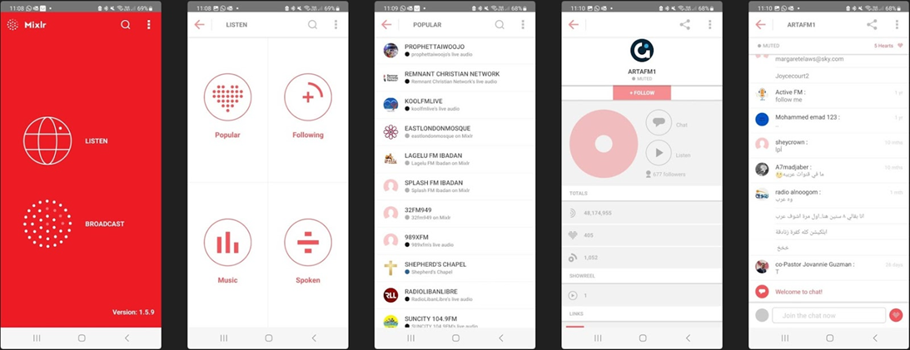
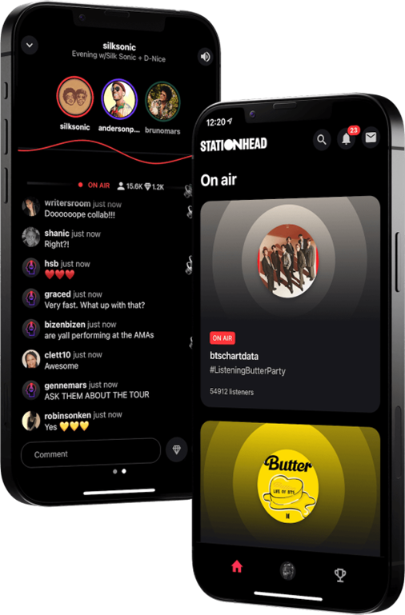
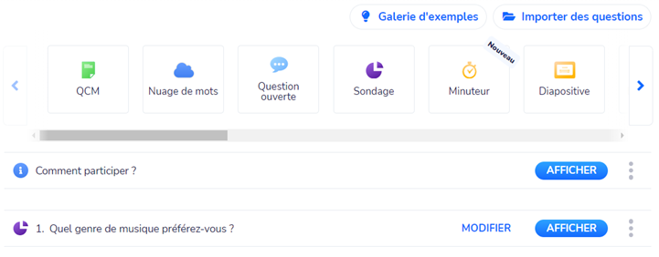
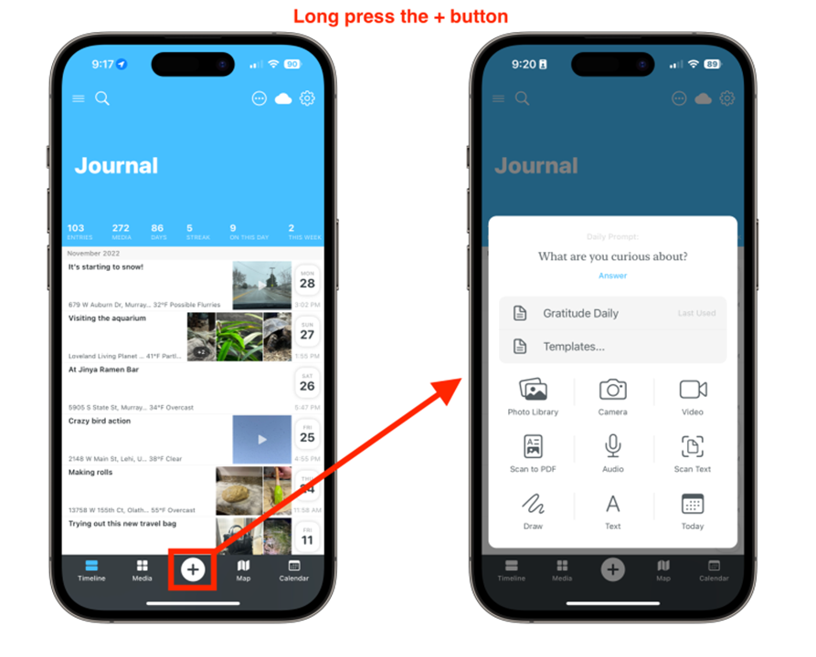

# Benchmark

## Apps similaires (radio etc)

#### Mixlr
Mixlr est une plateforme de diffusion audio en direct spécialement conçue pour les radios en ligne. Elle offre une interface conviviale qui permet de diffuser en direct, de discuter avec les auditeurs via un chat en direct et de partager des images pertinentes. Mixlr propose également des fonctionnalités avancées telles que la programmation des émissions et la possibilité d'enregistrer les diffusions pour une écoute ultérieure.

**Avantages:
- Accès à plusieurs Radio en ligne
- Chat en live 
- Planification des émissions, possibilité de programmer des playlists, et même diffusion en direct à partir de matériels externes tels que des consoles de mixage.
- Facilité d'utilisation (Interface utilisateur conviviale et intuitive, ce qui facilite le choix d’une station de radio en ligne)

**Désavantages : 
- Limitations de la version gratuite (Pour accéder à des fonctionnalités plus avancées ou pour des diffusions de longue durée)
- Messages dans le chat qui datent de plus d’un jour 
- Obligé de créer ou de se connecter pour interagir dans le chat  

#### Stationhead
Stationhead est une application de radio sociale qui permet aux utilisateurs de créer leur propre station de radio et de diffuser de la musique en direct. Elle offre des fonctionnalités de chat en direct pour interagir avec les auditeurs, ainsi que la possibilité de partager des images liées à la musique diffusée. Stationhead permet également aux auditeurs de participer à des sondages et de demander des chansons.  

**Avantages:
- Interaction sociale (envoyer des messages, interagir avec les utilisateurs via le chat en direct et partager leurs commentaires)
- Découverte de nouvelles musiques (Les utilisateurs peuvent créer des playlists personnalisées, partager des recommandations musicales)

**Désavantages:
- Restrictions de contenu musical
- Disponibilité limitée (limite l'accès à l'application pour les utilisateurs internationaux)

  

## Interactions intéressantes

#### Wooclap
Wooclap est « un système de questions/réponses en temps réel qui permet aux enseignants d’interagir avec leurs étudiants » via ordinateur, tablette ou smartphone. L’application permet de collecter et traiter instantanément des réponses transmises via wifi/4G ou SMS. 

**Avantages:
- Questionner l’audience en temps réel. 
- La question apparaît en même temps à l'écran des participants
- Envoi de messages en temps réel via le mur de messages
- Importer des questions
- Galerie d’exemples de questions pour s’inspirer et pas partir de zéro
- Préparer une collection de questions à l’avance. Possibilité de les afficher une à une.
- Possibilité d’afficher les résultats pour les participants
- Participants anonymes et possibilité de mettre un pseudo  

**Désavantage:
- Ne récupère pas le pseudo des participants

#### DayOne
DayOne est une application de journal.
La fonctionnalité des “daily prompts” permet de recevoir quotidiennement un sujet auquel il sera possible de répondre en ajoutant du contenu, que ce soit du texte, une image, une vidéo ou même de l’audio.

#### MonkeyLearn
La fonctionnalité “Survey Analysis” de MoneyLearn permet de regrouper, trier, organiser les réponses d’un sondage dans un seul endroit. La visualisation des réponses permet d’identifier des tendances, d’approfondir et tirer des conclusions.

## Ressources intéressantes sur l’engagement en direct des utilisateurs

#### Source I : Article
**“La radio a des fans, mais a du mal à faire interagir les gens”

*Les médias romands frileux sur les réseaux sociaux, [sans date]. Les médias romands frileux sur les réseaux sociaux [en ligne]. [Consulté le 23 mai 2023]. Disponible à l’adresse : [https://www.arcinfo.ch/economie/entreprises-innovation/les-medias-romands-frileux-sur-les-reseaux-sociaux-280544](https://www.arcinfo.ch/economie/entreprises-innovation/les-medias-romands-frileux-sur-les-reseaux-sociaux-280544)

Dans cet article, on apprend que la radio a encore beaucoup d'auditeurs. Elle a par contre du mal, exception faite de quelques rares acteurs, à les faire interagir. La presse quotidienne connaît une progression remarquable avec des taux d'interaction élevés et un engagement significatif, surpassant même la radio malgré une base de fans trois fois plus petite.
  

#### Source II : Article
**“Une application pour des pauses café virtuelles”

*Une entreprise suisse développe une application pour des pauses-café virtuelles | STARTUPS.CH Blog, 2021. STARTUPS.CH Blog | [en ligne]. [Consulté le 24 mai 2023]. Disponible à l’adresse : [https://blog.startups.ch/fr/2021/05/10/une-entreprise-suisse-developpe-une-application-pour-des-pauses-cafe-virtuelles/](https://blog.startups.ch/fr/2021/05/10/une-entreprise-suisse-developpe-une-application-pour-des-pauses-cafe-virtuelles/)

CoffeeCall est une application qui offre aux utilisateurs la possibilité de faire des pauses-café virtuelles, apportant ainsi un peu de normalité dans la vie quotidienne des employés en télétravail. Avec des appels limités à dix minutes, des interlocuteurs choisis aléatoirement et des amorces de conversation intégrées, l'application permet de rencontrer de nouvelles personnes et de briser la glace.

#### Source III : Article
**“Utilisation de la radio en Suisse Romande par tranches d’âge, en min. par jour”

*Office Fédéral de la Statistique [2021]. Radio: utilisation en Suisse Romande [en ligne]. [Consulté le 24 mai 2023]. Disponible à l’adresse: [https://www.bfs.admin.ch/bfs/fr/home/statistiques/culture-medias-societe-information-sport/medias/offre-utilisation/radio/utilisation-radio.assetdetail.22869556.html](https://www.bfs.admin.ch/bfs/fr/home/statistiques/culture-medias-societe-information-sport/medias/offre-utilisation/radio/utilisation-radio.assetdetail.22869556.html)

Les plus de 60 ans écoutent le plus la radio, les 15-29 le moins. Le nombre d'auditeurs chute de manière régulière, et l’écart entre le nombre d’auditeurs des différents groupes d’âge se réduit. 

#### Source IV : Article
**“Parts de marché, pénétration et modes de diffusion de la radio en Suisse et Suisse romande.”

*SRG-SSR. (2021). Chiffres, données, faits 2021 [Fichier PDF], p. 11, p. 30. Disponible à l’adresse: [https://gb.srgssr.ch/archiv/fileadmin/gb2020/pdf/Download-Center/SRG_ZDF_2021_fr.pdf](https://gb.srgssr.ch/archiv/fileadmin/gb2020/pdf/Download-Center/SRG_ZDF_2021_fr.pdf)

Intéressant:
- P. 11: pénétration et parts de marché
- P. 30: modes de réception de la radio (DAB+, FM, Internet/Radio numérique)
