# Intégration continue

```mermaid
flowchart LR
    subgraph setup
        direction TB

        setup-php
        install-composer-depedencies

        setup-node
        install-npm-dependencies
    end

    subgraph format
        direction LR

        laravel-pint[<a href='https://laravel.com/docs/10.x/pint'>laravel-pint</a>]
        prettier[<a href='https://prettier.io/'>prettier</a>]
    end

    subgraph lint
        direction LR

        larastan[<a href='https://github.com/nunomaduro/larastan'>larastan</a>]
        eslint[<a href='https://eslint.org/'>eslint</a>]
    end

    subgraph test
        direction LR

        pest[<a href='https://pestphp.com/'>pest</a>]
    end

    subgraph security
        direction LR

        php-security-checker[<a href='https://github.com/enlightn/security-checker'>php-security-checker</a>]
        npm-audit[<a href='https://docs.npmjs.com/cli/v9/commands/npm-audit'>npm-audit</a>]
    end

    subgraph build
        direction LR

        npm-build
        composer-production
    end

    subgraph deploy
        direction LR

        connect-ssh
    end

    setup-php --> install-composer-depedencies
    setup-node --> install-npm-dependencies

    setup --> format
    format --> lint
    lint --> test
    test --> security
    security --> build
    build --> deploy
```

## Laravel Pint

Documentation: https://laravel.com/docs/10.x/pint

Laravel Pint est un outil de correction de style de code PHP pour les applications Laravel. Basé sur PHP-CS-Fixer, il permet de maintenir un style de code propre et cohérent.

## Prettier

Documentation: https://prettier.io/

Prettier est un outil de formatage de code qui permet d'automatiser et d'uniformiser la mise en forme du code source. Il prend en charge plusieurs langages de programmation, tels que JavaScript, TypeScript, CSS, HTML, JSON et bien d'autres.

## Larastan

Documentation: https://github.com/nunomaduro/larastan

Larastan est un outil d'analyse statique de code spécifiquement conçu pour les applications Laravel. Il utilise [PHPStan](https://phpstan.org/), un outil d'analyse statique pour PHP, pour détecter les erreurs potentielles, les problèmes de typage, les incohérences de méthode, les problèmes de performance et autres erreurs courantes dans le code Laravel

## ESLint

Documentation: https://eslint.org/

ESLint est un outil de linting pour JavaScript et TypeScript. Il permet de détecter et de signaler les erreurs de syntaxe, les problèmes de style et les erreurs logiques dans le code

## Pest

Documentation: https://pestphp.com/

Pest est un framework de test unitaire pour PHP. Il permet aux développeurs d'écrire et d'exécuter des tests automatisés pour vérifier le bon fonctionnement de leur code PHP.

## PHP Security Checker

Documentation: https://github.com/enlightn/security-checker

PHP Security Checker est un outil qui permet de vérifier si les dépendances PHP d'un projet contiennent des vulnérabilités connues.

## npm audit

Documentation: https://docs.npmjs.com/cli/v9/commands/npm-audit

C'est une commande fournie par npm, le gestionnaire de paquets de Node.js. Elle permet de vérifier les dépendances d'un projet JavaScript pour détecter les vulnérabilités connues et les problèmes de sécurité.
