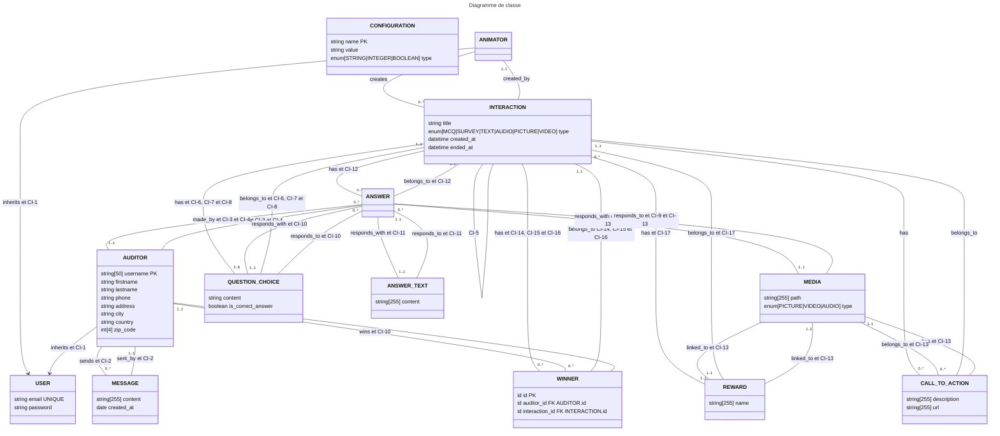

```mermaid
---
title: Diagramme de classe
---

classDiagram
    class CONFIGURATION {
        string name PK
        string value
        enum[STRING|INTEGER|BOOLEAN] type
    }

    class USER {
        string email UNIQUE
        string password
    }

    class ANIMATOR {
    }

    class AUDITOR {
        string[50] username PK
        string firstname
        string lastname
        string phone
        string address
        string city
        string country
        int[4] zip_code
    }

    class MESSAGE {
        string[255] content
        date created_at
    }

    class MEDIA {
        string[255] path
        enum[PICTURE|VIDEO|AUDIO] type
    }

    class INTERACTION {
        string title
        enum[MCQ|SURVEY|TEXT|AUDIO|PICTURE|VIDEO] type
        datetime created_at
        datetime ended_at
    }

    class REWARD {
        string[255] name
    }

    class QUESTION_CHOICE {
        string content
        boolean is_correct_answer
    }

    class ANSWER {
    }

    class ANSWER_TEXT {
        string[255] content
    }

    class WINNER {
        id id PK
        id auditor_id FK AUDITOR.id
        id interaction_id FK INTERACTION.id
    }

    class CALL_TO_ACTION {
        string[255] description
        string[255] url
    }

    ANIMATOR --> USER : inherits et CI-1
    AUDITOR --> USER : inherits et CI-1

    ANIMATOR -- "0..*" INTERACTION : creates
    INTERACTION -- "1..1" ANIMATOR : created_by

    AUDITOR -- "0..*" MESSAGE : sends et CI-2
    MESSAGE -- "1..1" AUDITOR : sent_by et CI-2

    INTERACTION -- INTERACTION : CI-5

    INTERACTION -- "0..*" ANSWER : has et CI-12
    ANSWER -- "1..1" INTERACTION : belongs_to et CI-12

    INTERACTION -- "0..*" CALL_TO_ACTION : has
    CALL_TO_ACTION -- "1..1" INTERACTION : belongs_to

    INTERACTION -- "2..6" QUESTION_CHOICE : has et CI-6, CI-7 et CI-8
    QUESTION_CHOICE -- "1..1" INTERACTION : belongs_to et CI-6, CI-7 et CI-8

    INTERACTION -- "1..1" REWARD : has et CI-17
    REWARD -- "0..*" INTERACTION : belongs_to et CI-17

    REWARD -- "1..1" MEDIA : linked_to et CI-13
    MEDIA -- "1..1" REWARD : linked_to et CI-13

    AUDITOR -- "0..*" ANSWER : makes et CI-3 et CI-4
    ANSWER -- "1..1" AUDITOR : made_by et CI-3 et CI-4

    CALL_TO_ACTION -- "1..1" MEDIA : has et CI-13
    MEDIA -- "0..*" CALL_TO_ACTION : belongs_to et CI-13

I   NTERACTION -- "0..*" WINNER : has et CI-14, CI-15 et CI-16
    WINNER -- "1..1" INTERACTION : belongs_to CI-14, CI-15 et CI-16

    AUDITOR -- "0..*" WINNER : wins et CI-10
    WINNER -- "1..1" AUDITOR

    ANSWER -- "1..1" QUESTION_CHOICE : responds_with et CI-10
    QUESTION_CHOICE -- "0..*" ANSWER : responds_to et CI-10

    ANSWER -- "1..1" ANSWER_TEXT : responds_with et CI-11
    ANSWER_TEXT -- "1..1" ANSWER : responds_to et CI-11

    ANSWER -- "1..1" MEDIA : responds_with et CI-9 et CI-13
    MEDIA -- "0..*" ANSWER : responds_to et CI-9 et CI-13
```
