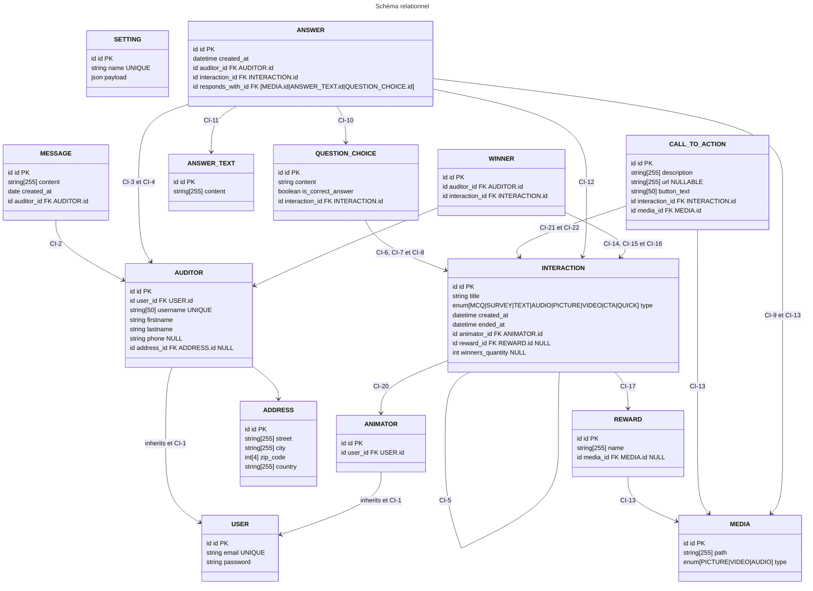

```mermaid
---
title: Schéma relationnel
---

classDiagram
    class SETTING {
        id id PK
        string name UNIQUE
        json payload
    }

    class USER {
        id id PK
        string email UNIQUE
        string password
    }

    class ANIMATOR {
        id id PK
        id user_id FK USER.id
    }

    class AUDITOR {
        id id PK
        id user_id FK USER.id
        string[50] username UNIQUE
        string firstname
        string lastname
        string phone NULL
        id address_id FK ADDRESS.id NULL
    }

    class ADDRESS {
        id id PK
        string[255] street
        string[255] city
        int[4] zip_code
        string[255] country
    }

    class MESSAGE {
        id id PK
        string[255] content
        date created_at
        id auditor_id FK AUDITOR.id
    }

    class MEDIA {
        id id PK
        string[255] path
        enum[PICTURE|VIDEO|AUDIO] type
    }

    class INTERACTION {
        id id PK
        string title
        enum[MCQ|SURVEY|TEXT|AUDIO|PICTURE|VIDEO|CTA|QUICK] type
        datetime created_at
        datetime ended_at
        id animator_id FK ANIMATOR.id
        id reward_id FK REWARD.id NULL
        int winners_quantity NULL
    }

    class REWARD {
        id id PK
        string[255] name
        id media_id FK MEDIA.id NULL
    }

    class QUESTION_CHOICE {
        id id PK
        string content
        boolean is_correct_answer
        id interaction_id FK INTERACTION.id
    }

    class ANSWER {
        id id PK
        datetime created_at
        id auditor_id FK AUDITOR.id
        id interaction_id FK INTERACTION.id
        id responds_with_id FK [MEDIA.id|ANSWER_TEXT.id|QUESTION_CHOICE.id]
    }

    class ANSWER_TEXT {
        id id PK
        string[255] content
    }

    class WINNER {
        id id PK
        id auditor_id FK AUDITOR.id
        id interaction_id FK INTERACTION.id
    }

    class CALL_TO_ACTION {
        id id PK
        string[255] description
        string[255] url NULLABLE
        string[50] button_text
        id interaction_id FK INTERACTION.id
        id media_id FK MEDIA.id
    }

    AUDITOR --> USER : inherits et CI-1
    ANIMATOR --> USER : inherits et CI-1

    AUDITOR --> ADDRESS

    MESSAGE --> AUDITOR : CI-2

    INTERACTION --> ANIMATOR : CI-20
    INTERACTION -- INTERACTION : CI-5
    INTERACTION --> REWARD : CI-17

    QUESTION_CHOICE --> INTERACTION : CI-6, CI-7 et CI-8

    REWARD --> MEDIA : CI-13

    CALL_TO_ACTION --> MEDIA : CI-13
    CALL_TO_ACTION --> INTERACTION : CI-21 et CI-22

    ANSWER --> AUDITOR : CI-3 et CI-4
    ANSWER --> INTERACTION : CI-12
    ANSWER --> ANSWER_TEXT : CI-11
    ANSWER --> QUESTION_CHOICE : CI-10
    ANSWER --> MEDIA : CI-9 et CI-13

    WINNER --> INTERACTION : CI-14, CI-15 et CI-16
    WINNER --> AUDITOR
```
