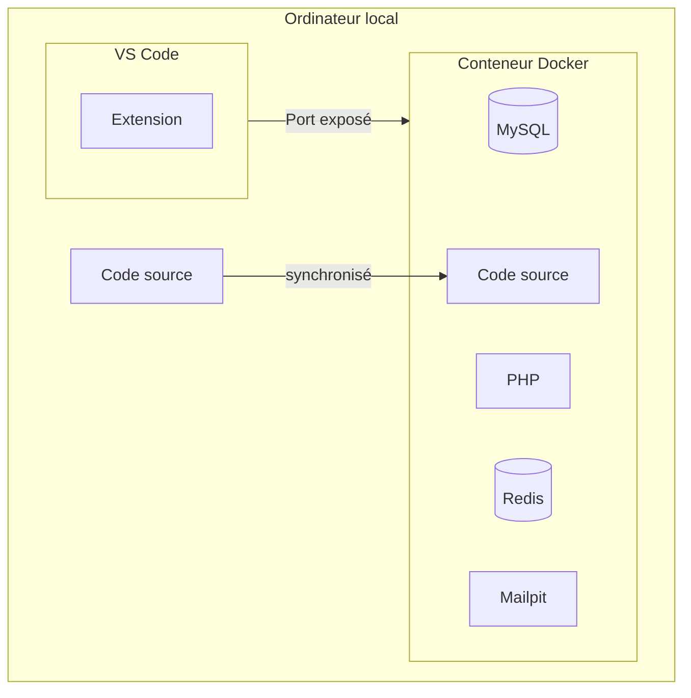

# Environnement de développement



## Prérequis

- [Docker](https://www.docker.com/) (pour Windows: avoir [WSL2](https://learn.microsoft.com/en-us/windows/wsl/about))
- [VS Code](https://code.visualstudio.com/)
- [VS Code - Remote Development (Extension)](https://marketplace.visualstudio.com/items?itemName=ms-vscode-remote.vscode-remote-extensionpack)

## Installation sur Windows

### 1. Cloner le projet

Ouvrir l'application *Terminal* et sélectionner le sous-système Ubuntu.


```bash
git clone https://github.com/C-Super/couleur3.git
```

### 2. Ouvrir le projet dans VS Code

Ouvrir le dossier du projet dans VS Code en utilisant le terminal Ubuntu.

```bash
cd couleur3 && code .
```

### 3. Ouvrir le projet dans un conteneur

Si ce n'est pas déjà fait, installer l'extension [Remote Development](https://marketplace.visualstudio.com/items?itemName=ms-vscode-remote.vscode-remote-extensionpack) dans VS Code.

Vous devriez voir une fenêtre de sélection de l'environnement de développement s'ouvrir.


Si vous ne voyer pas la fenêtre de sélection de l'environnement de développement.

- Ouvrir la palette de commande (Ctrl + Shift + P)
- Rechercher et sélectionner `Remote-Containers: Open Folder in Container...`
- Sélectionner le dossier du projet

Cela peut prendre quelques minutes la première fois que vous ouvrez le projet dans un conteneur.

### 4. Ouvrir l'application dans le navigateur

Quand le conteneur est prêt, vous devriez voir un icône (une petite antenne) dans la barre d'outils de VS Code.


Vous pouvez maintenant ouvrir l'application dans votre navigateur à l'adresse [http://localhost:8080](http://localhost:80).


Voilàà ! Vous pouvez maintenant commencer à développer.

## Installation sur Mac
