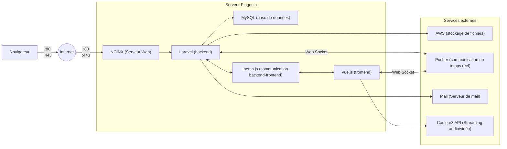

# Architecture de l'application Couleur3

```mermaid
flowchart LR
    navigator[Navigateur]

    internet((Internet))

    subgraph Serveur Pingouin

        nginx["NGINX (Serveur Web)"]

        laravel["Laravel (backend)"]

        mysql["MySQL (base de données)"]

        inertia["Inertia.js (communication backend-frontend)"]

        vue["Vue.js (frontend)"]

    end

    subgraph Services externes

        aws["AWS (stockage de fichiers)"]

        pusher["Pusher (communication en temps réel)"]

        mail["Mail (Serveur de mail)"]

        couleur3["Couleur3 API (Streaming audio/vidéo)"]

    end

    navigator -->|":80
        :443"| internet

    internet -->|":80
        :443"| nginx

    nginx --> laravel

    laravel --> mail

    laravel <--> inertia

    inertia <--> vue

    laravel --> mysql

    laravel --> aws

    laravel <-->|Web Socket| pusher

    vue <-->|Web Socket| pusher

    vue --> couleur3
```